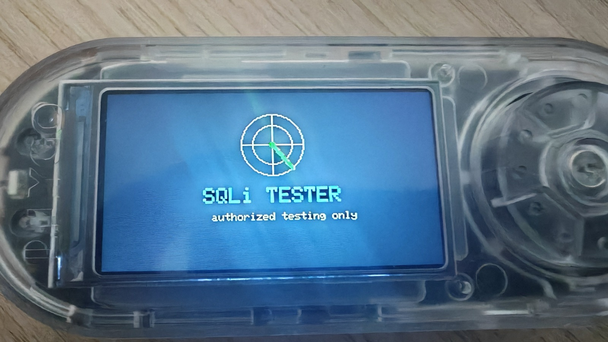
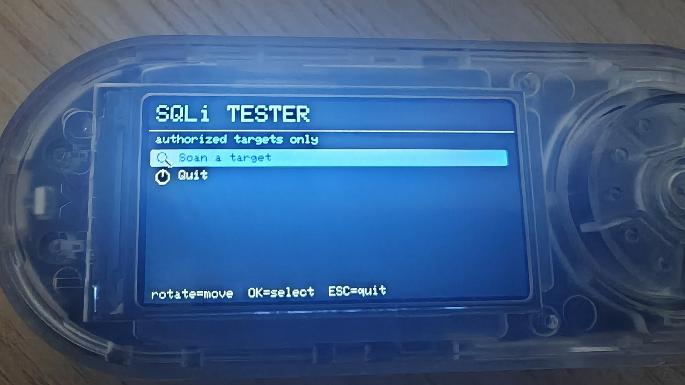
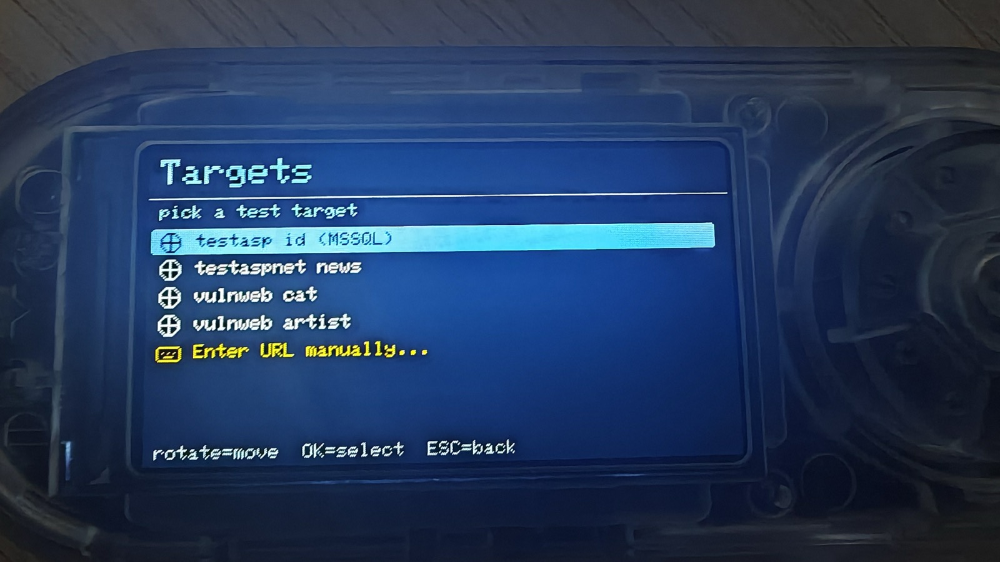
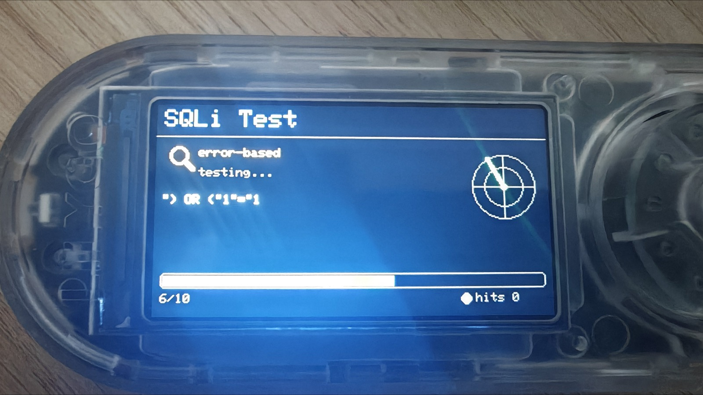
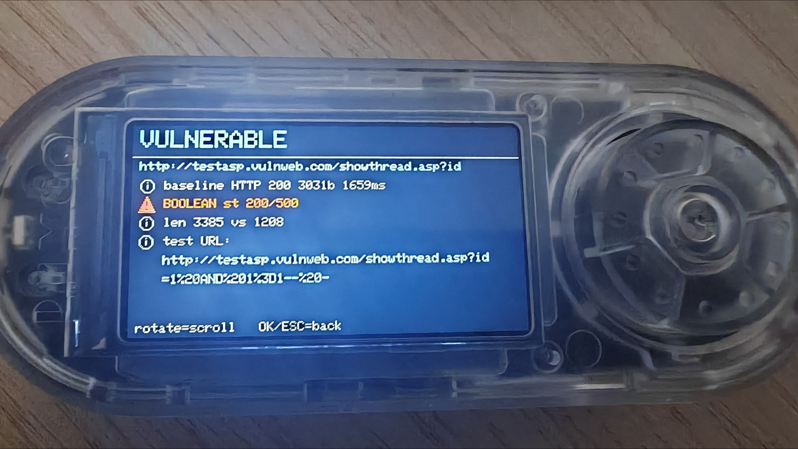
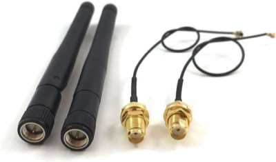

# 💉 SQLi Tester — Bruce / LilyGO T-Embed CC1101

[](https://github.com/BruceDevices/firmware) [](https://github.com/BruceDevices/firmware) [-F7DF1E)](https://github.com/BruceDevices/firmware) [](LICENSE)

> **EN** — A small **SQL-injection tester** for the Bruce JS interpreter. Point it at a URL with a parameter, and it runs error-based, time-based (blind) and boolean-based checks against a clean baseline — right from the device, with a clean picto UI. Targets are read from an editable `sqli_targets.txt`.

> **FR** — Un petit **testeur d'injection SQL** pour l'interpréteur JS de Bruce. Vise une URL avec un paramètre, et il lance des tests **error-based**, **time-based (aveugle)** et **boolean-based** par rapport à une réponse de référence — depuis l'appareil, avec une interface à pictogrammes. Les cibles sont lues depuis un fichier `sqli_targets.txt` éditable.



## ⚠️ Legal / Légal

**EN — For authorized security testing only.** Use it exclusively on **your own** servers or targets you have **explicit written permission** to test (the bundled `testphp/testasp.vulnweb.com` are public, intentionally-vulnerable practice sites). Testing systems without authorization is illegal.

**FR — Pour du test de sécurité autorisé uniquement.** À utiliser exclusivement sur **tes propres** serveurs ou des cibles pour lesquelles tu as une **autorisation écrite explicite** (les hôtes `vulnweb.com` fournis sont des sites d'entraînement publics volontairement vulnérables). Tester un système sans autorisation est illégal.

## ✨ Features / Fonctions

- 🎯 **Target menu from a file** — pick a target directly from `sqli_targets.txt` (label + URL), or type one manually. No long typing on the device.
- 🔎 **3 detection methods** over a clean baseline request:
  - **error-based** — a DB error string appears that wasn't in the baseline
  - **time-based (blind)** — a `SLEEP()/WAITFOR` payload makes the response ~3 s slower
  - **boolean-based** — `AND 1=1` vs `AND 1=2` give clearly different responses
- 🔗 **Exact test URL in the report** — every finding shows the precise (URL-encoded) request that triggered it, ready to reproduce in a browser or `curl`.
- 🎨 **Picto UI** — animated scanning screen (magnifier + radar + progress + live hit counter), flicker-free scrollable report.

| Menu | Targets | Scanning | Result |
|---|---|---|---|
|  |  |  |  |

## 🚀 Install

1. Copy **`SQL Injection.js`** and **`sqli_targets.txt`** onto the SD card (e.g. into `/scripts`, or the SD root for the targets file).
2. On the device: **JS Interpreter → select `SQL Injection.js`** (or add it to your favorites with [bruce-launcher](https://github.com/koua29/bruce-launcher)).
3. **Rotate** = move, **click** = select/scan, **long-press (ESC)** or **click** = back.

**Add your own targets** — just edit `sqli_targets.txt`, one per line:
```
label | http://host/page.php?id=1
```
The payload is appended to the **end** of the URL, so end it on the **parameter value** you want to test. If the file is missing, three built-in demo targets are used.

## 🛠️ How it works

Bruce's JS interpreter exposes **no raw TCP socket** and **no `encodeURIComponent`** — only `wifi.httpFetch()`. So the tool URL-encodes payloads by hand, sends plain HTTP requests, and compares each response to a baseline (status code, body length, response time, and DB-error signatures).

## ⚠️ Limitations

- **HTTPS/TLS** targets are probed as plain HTTP and usually can't be read reliably.
- The public `vulnweb.com` practice hosts go up/down often — *"baseline request failed / connection refused"* usually means **that host is down**, not a bug. Try another, or self-host a lab (DVWA, SQLi-Labs, bWAPP) over HTTP for reliable practice.
- This is a **first-pass detector**, not a full exploitation framework. Confirm findings with a real tool on an authorized target.

## 🛒 Matériel / Hardware

Accessoires utiles pour ce projet — liens affiliés Amazon :

| [](https://www.amazon.com/dp/B0GXB24SRR?linkCode=ll2&tag=koua29-20&ref_=as_li_ss_tl) | [](https://www.amazon.com/dp/B0C1FCZM94?linkCode=ll2&tag=koua29-20&ref_=as_li_ss_tl) | [](https://www.amazon.com/dp/B0B7NVMBPL?linkCode=ll2&tag=koua29-20&ref_=as_li_ss_tl) |
|:---:|:---:|:---:|
| 🛡️ **[T-Embed CC1101 screen protector](https://www.amazon.com/dp/B0GXB24SRR?linkCode=ll2&tag=koua29-20&ref_=as_li_ss_tl)**<br><sub>Lamshaw, film TPU ×6</sub> | 📡 **[433 MHz SMA antenna (2-pack)](https://www.amazon.com/dp/B0C1FCZM94?linkCode=ll2&tag=koua29-20&ref_=as_li_ss_tl)**<br><sub>Antenne sub-GHz pour la radio CC1101</sub> | 💾 **[SanDisk 64 GB microSD (2-pack)](https://www.amazon.com/dp/B0B7NVMBPL?linkCode=ll2&tag=koua29-20&ref_=as_li_ss_tl)**<br><sub>Pour les thèmes, scripts et captures Bruce</sub> |

<sub>En tant que Partenaire Amazon, je réalise un bénéfice sur les achats remplissant les conditions requises. · As an Amazon Associate I earn from qualifying purchases.</sub>

## 🙏 Credits & License

- Script: **koua29**. Runs on the excellent **[Bruce firmware](https://github.com/BruceDevices/firmware)**.
- Released under the **MIT License** — see [LICENSE](LICENSE).

## ☕ Coffee?


